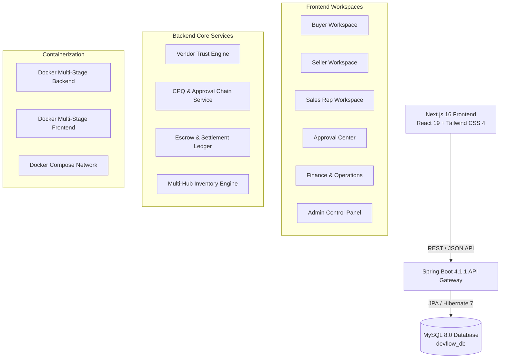
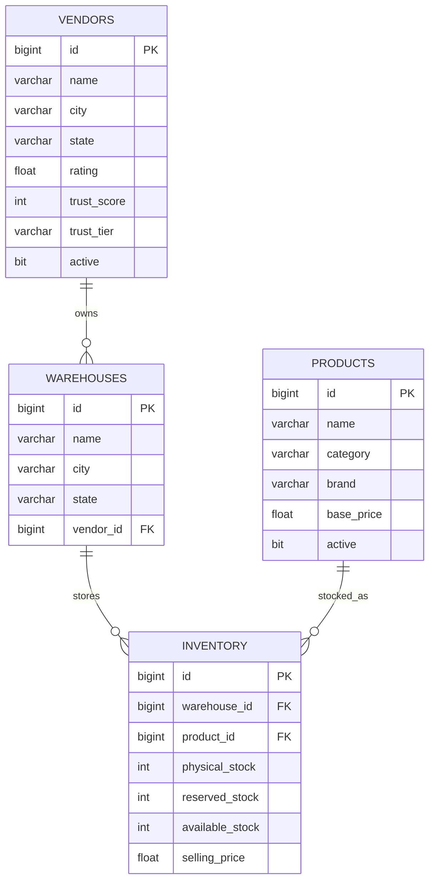

# DEV FLOW — Project Documentation & Presentation Guide
### *Intelligent Deal, Procurement & Sales Operations Platform*
**Built for the Odoo Hackathon**

---

## 📌 Executive Summary

**DEV FLOW** is an intelligent, full-stack B2B deal and procurement operations platform designed to eliminate fragmentation in enterprise trade. In conventional supply chains, buyers, sellers, sales reps, operations, and finance teams operate across disconnected silos (email threads, spreadsheets, standalone ERPs, and unverified bank transfers). 

DEV FLOW bridges this gap by unifying the entire deal lifecycle into a single, trust-governed workspace:
> **Source ➔ Compare ➔ Negotiate ➔ Approve ➔ Protect (Escrow) ➔ Fulfil ➔ Bill**

---

## 🎯 The Core Problem & Solution

### The Problem
1. **Unverified Supplier Trust**: Buyers struggle to verify vendor reliability, on-time delivery rates, and defect histories.
2. **Opaque Negotiations**: Quotations and counter-offers are lost in scattered email threads with no version control.
3. **Discount Margin Erosion**: Sales reps grant arbitrary discounts without automated margin governance.
4. **Payment Risk & Capital Exposure**: Buyers hesitate to pay upfront; suppliers fear non-payment after delivery.
5. **Multi-Hub Fulfillment Friction**: Inventory is trapped in disparate regional warehouses with no split-fulfillment intelligence.

### The DEV FLOW Solution
1. **Algorithmic Trust Engine**: Quantified vendor scoring (0–100) determining **Gold**, **Silver**, and **Bronze** tiers based on on-time delivery, quality history, and dispute resolution.
2. **Real-Time Interactive Negotiation Room**: Counter-offer workspace with live margin tracking and contract lock-in.
3. **Automated CPQ & Multi-Tier Approvals**: Dynamic quote builder that flags margin floor breaches (>10% discount) to Sales Managers with 1-click approvals.
4. **Milestone Escrow Protection**: Safe fund locking on purchase order release, with automatic settlement upon buyer delivery sign-off.
5. **Multi-Warehouse Allocation Hub**: Intelligent stock allocation across regional distribution centers (e.g., Mumbai, Pune, Bengaluru, Chennai).

---

## 🏗️ System Architecture & Technology Stack



### Technology Matrix

| Layer | Technologies | Version / Details |
|---|---|---|
| **Frontend Framework** | Next.js (App Router), React | Next.js 16.3.4, React 19.2.8 |
| **Styling & UI** | Tailwind CSS 4, Framer Motion, Lucide Icons | Responsive enterprise dark navy + warm neutral palette |
| **Backend Core** | Java, Spring Boot | Java 17, Spring Boot 4.1.1 |
| **Persistence Layer** | Spring Data JPA, Hibernate ORM | Hibernate 7.4.5, HikariCP Connection Pooling |
| **Database** | MySQL Server | MySQL 8.0 (`devflow_db`) |
| **Security & Dev Tools** | Lombok, Jakarta Validation, BCrypt | Automated DDL generation & schema constraints |
| **DevOps & Containers** | Docker, Docker Compose | Multi-stage builder/runner images, healthchecks |

---

## 🗄️ Database Architecture & Data Model

### Entity-Relationship Overview



### Database Schema Highlights
- **Unique Constraint**: `inventory (warehouse_id, product_id)` ensures data integrity and prevents duplicate stock records across fulfillment nodes.
- **Foreign Key Cascade & Indexing**: Foreign keys from `warehouses -> vendors(id)`, `inventory -> warehouses(id)`, and `inventory -> products(id)`.
- **Automated Seeder (`DataSeeder.java`)**:
  - **50 Enterprise B2B Vendors**: Real industrial brands (*Tata Steel*, *Larsen & Toubro*, *Siemens*, *Schneider Electric*, *Havells*, *Bosch Rexroth*, *ABB*, *SKF*, *Festo*, *Honeywell*, *3M*, *Mitutoyo*, *Polycab*, etc.).
  - **85 Industrial Warehouses**: Spread across India’s primary logistics clusters (Bhiwandi, Chakan, Whitefield, Sriperumbudur, Sanand, Manesar, Shamshabad, Dankuni, etc.).
  - **130 B2B Catalog Products**: Categorized into 7 verticals (*Electrical*, *Mechanical*, *Hydraulics*, *Automation*, *Safety/PPE*, *Metals*, *Tooling*).
  - **500 Unique Inventory Combinations**: Realistic physical stock, reserved buffer, available-to-promise, and retail price markups.

---

## 👥 Role-Based Workspaces (RBAC)

DEV FLOW provides tailored interfaces for every persona in the deal chain:

| Role | Workspace Route | Primary Capabilities |
|---|---|---|
| **BUYER** | `/buyer` | Raise RFQs, compare vendor quotations, search verified local suppliers, track escrow shipments |
| **SELLER** | `/seller` | Discover live buyer RFQs, submit competitive quotations, track margins, negotiate counter-offers |
| **SALES_REP** | `/sales` | Manage commercial pipeline, CPQ quotation builder, customer accounts CRM, view activity stream |
| **SALES_MANAGER** | `/approvals` | Review discount exceptions, 1-click approvals/rejections, quota attainment, OOO delegation |
| **FINANCE_OPERATIONS** | `/operations` | Escrow account verification, multi-hub fulfillment dispatch, invoice registry, tax schedules |
| **ADMIN** | `/admin` | Global users/roles, master product catalog, pricing rules, trust engine policies, multi-hub inventory |

---

## 🚀 Key Modules Built & Operational

### 1. Operations Workspace
- **Billing & Invoice Registry (`/operations/billing`)**:
  - Live financial metrics: Total Billed (₹1.48 Cr), Paid / Settled, Awaiting Payment, Recurring MRR.
  - Search and filter by status (`PAID`, `ISSUED`, `PARTIALLY_PAID`) and billing cadence (`ONE_TIME`, `RECURRING`).
  - Direct navigation to detailed invoices (`/operations/billing/DF-2048`) with one-time vs. recurring breakdowns.
- **Escrow & Payment Settlements (`/operations/payments`)**:
  - Real-time escrow lock verification, bank UTR tracking, and release authorizations.
- **Fulfilment & Dispatch Center (`/operations/fulfilment`)**:
  - Multi-warehouse order split allocations, logistics carrier manifests, and delivery confirmations.
- **Operations Controller Profile (`/operations/profile`)**:
  - Signatory limits (up to ₹50L), FIDO2 hardware token verification, and 2FA governance.

### 2. Buyer Workspace
- **My Deals Pipeline (`/buyer/deals`)**: Complete deal tracking across Sourcing, Comparing, Negotiating, Approved, and Fulfilled stages.
- **Local Sellers Directory (`/buyer/local`)**: Geo-filtered directory with Trust Tier filters (Gold, Silver, Bronze) and links to Trust Scorecards.
- **Buyer Organization Profile (`/buyer/profile`)**: Enterprise GSTIN, drop-off warehouses, and procurement budgets.

### 3. Seller Workspace
- **Buyer RFQ Marketplace (`/seller/opportunities`)**: Real-time buyer requests with urgency tags, budget estimates, and an interactive **"Bid Quotation"** modal.
- **Submitted Quotes Tracker (`/seller/quotes`)**: Live quote statuses, margin % monitoring, and direct links to the Negotiation Room.
- **Seller Business Profile (`/seller/profile`)**: Verified supplier badge, escrow bank accounts, and linked warehouse hubs.

### 4. Sales Rep & Manager Workspaces
- **Deals Pipeline (`/sales/deals`)**: Full commercial stage tracking (Lead, Quoted, Negotiation, Approved, Won) with health indicators.
- **Corporate CRM (`/sales/customers`)**: Lifetime volume analytics, key contact details, and an "Add Account" modal.
- **Activity Stream (`/sales/activity`)**: Chronological audit trail of counter-offers, manager approvals, and escrow releases.
- **CPQ Quotation Builder (`/sales/quotations/new`)**: Live catalog line-item selection, quantity and discount sliders, gross margin computation, and automatic manager approval warnings for discounts > 10%.
- **Pending Approvals Queue (`/approvals/pending`)**: 1-click Approve / Reject actions for discount breaches with audit breakdowns.
- **Team Governance (`/approvals/team`)**: Quota attainment bars, closed deals volume, and Out-of-Office delegation toggle.
- **Manager Governance Profile (`/approvals/profile`)**: Level-2 authority settings and escalation thresholds.

### 5. Admin Control Panel
- **Users & Roles (`/admin/users`)**: Full RBAC table with instant account creation modal.
- **Master Product Catalog (`/admin/products`)**: SKU registry, brand management, and baseline pricing.
- **Commercial Pricing Rules (`/admin/pricing`)**: Minimum margin floors (15%), discount approval ceilings, and platform escrow tariffs.
- **Vendor Trust Engine Policy (`/admin/trust-policy`)**: Configurable weighting sliders (delivery 40%, defect 30%, dispute 20%, verified docs 10%).
- **Deal Health Policy (`/admin/deal-health-policy`)**: Healthy / Watch / Critical penalty thresholds.
- **Warehouses Directory (`/admin/warehouses`)**: Logistics network capacity and active stock counts.
- **Multi-Hub Inventory Management (`/admin/inventory`)**: Physical vs. reserved stock tracking, low-stock warnings, and database synchronization.
- **SaaS Subscriptions (`/admin/subscriptions`)**: MRR, ARR, and recurring billing contracts.

---

## 🐳 Containerization & Deployment

The entire stack is containerized with production-grade Dockerfiles:

```
Odoo-Hackathon/
├── docker-compose.yml           # Unified orchestration
├── backend/
│   ├── Dockerfile               # Multi-stage Maven + Eclipse Temurin 17 JRE
│   └── .dockerignore            # Clean build context
└── dev-flow/
    ├── Dockerfile               # Multi-stage Node 20 + Next.js Standalone
    └── .dockerignore            # Ignores node_modules, .next
```

### Launching the Full Stack
```bash
# Build and start Database, Backend API, and Frontend:
docker compose up --build

# Endpoints:
# Frontend Application:  http://localhost:3000
# Spring Boot API:        http://localhost:8080
# MySQL Server:           localhost:3306
```

---

## 📊 Presentation (PPT) Slide Deck Outline

Use this structured 10-slide outline for hackathon demo presentations:

### Slide 1: Title & Hook
- **Title**: DEV FLOW — *The Smarter Way to Make a Deal*
- **Subtitle**: An Intelligent Deal, Procurement & Sales Operations Platform
- **Tagline**: Source • Compare • Negotiate • Approve • Fulfil • Bill
- **Presented by**: Team DEV FLOW

### Slide 2: The B2B Procurement Dilemma
- B2B trade is fragmented across emails, spreadsheets, and unverified bank transfers.
- 4 Critical Pain Points:
  1. *Lack of Supplier Trust* (no verified performance metrics).
  2. *Margin Erosion* (sales reps offering unchecked discounts).
  3. *Payment Insecurity* (fear of non-delivery or non-payment).
  4. *Logistics Blind Spots* (uncoordinated multi-warehouse fulfillment).

### Slide 3: The DEV FLOW Solution
- An integrated, role-based operating system for modern commercial trade.
- Visual flow of the 7-stage deal lifecycle:
  `Request ➔ Discover ➔ Quote ➔ Approve ➔ Negotiate ➔ Protect ➔ Fulfil ➔ Bill`

### Slide 4: Key Innovation 1 — The Trust Engine
- Real-time algorithmic vendor rating (0–100 score).
- Tiers: **Gold** (Score 90+), **Silver** (75+), **Bronze** (<75).
- Weighted parameters: On-Time Delivery (40%), Defect-Free Quality (30%), Dispute Resolution (20%), Document Verification (10%).
- Impact: Lower escrow retention holds and priority bidding for top vendors.

### Slide 5: Key Innovation 2 — CPQ & Automated Governance
- Interactive Quote Builder with live margin tracking.
- Policy Enforcement: Discounts >10% automatically route to the Sales Manager approval queue.
- 1-Click manager approval or rejection with instant counter-offer feedback.

### Slide 6: Key Innovation 3 — Protected Escrow Settlements
- Eliminates counterparty risk.
- Buyer funds are locked in an Axis Bank-backed digital escrow upon Purchase Order.
- Funds are automatically released to the supplier only when delivery and physical inspection are confirmed by the buyer.

### Slide 7: Key Innovation 4 — Multi-Hub Fulfillment
- Intelligent stock allocation across regional warehouses (e.g., 30 units from Mumbai + 20 units from Pune).
- Real-time synchronization of physical vs. reserved vs. available stock across 85 distribution centers.

### Slide 8: Enterprise Architecture & Tech Stack
- **Frontend**: Next.js 16 (Turbopack, App Router) + Tailwind CSS 4 + Framer Motion.
- **Backend**: Spring Boot 4.1.1 + Spring Data JPA + Hibernate 7.
- **Database**: MySQL 8.0 with automated foreign-key constraints & unique index integrity.
- **DevOps**: Multi-stage Docker + Docker Compose orchestration.

### Slide 9: Live Demo Walkthrough
- **Scenario**:
  1. Buyer raises requirement for 50 Business Laptops.
  2. Seller submits quotation via RFQ Marketplace.
  3. Sales Rep creates custom CPQ quote with 12% discount (triggers manager approval).
  4. Sales Manager reviews deal health and approves in 1 click.
  5. Operations verifies escrow lock and coordinates multi-hub dispatch.
  6. Finance generates hybrid one-time + recurring subscription invoice.

### Slide 10: Summary & Business Value
- **70% Faster Deal Turnaround**: Automated approval routing replaces days of email back-and-forth.
- **Zero Payment Defaults**: 100% escrow-backed commercial transactions.
- **Protected Profit Margins**: Strict policy enforcement on minimum floors.
- **Production-Ready**: 46 fully compiled routes, 500+ seeded records, containerized deployment.

---

## 🏆 Summary Checklist for Evaluators

- [x] **Backend Fix**: Correct package structuring, JPA repository scanning, and automated MySQL DDL generation.
- [x] **Realistic Data**: 50 vendors, 85 warehouses, 130 products, and 500 unique inventory records seeded.
- [x] **Docker Setup**: Complete multi-stage Dockerfiles and Docker Compose configuration.
- [x] **Frontend Polish**: 100% functional screens across Buyer, Seller, Sales Rep, Sales Manager, Operations, and Admin workspaces.
- [x] **Zero Errors**: Next.js production build succeeds with 46/46 routes compiled cleanly.